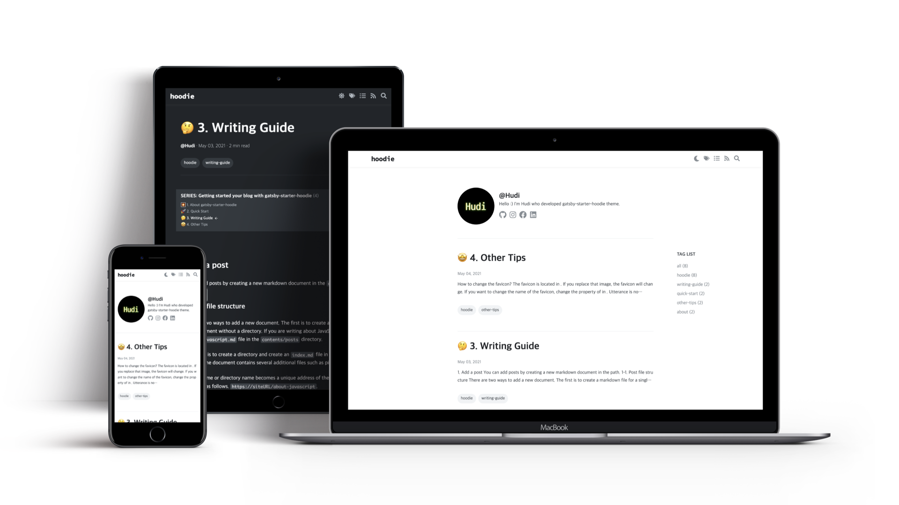

<h1 align="center">
    dev0wner's blog
</h1>

<h4 align="center">
  Data Engineer(5y), Cloud Engineer(1y)
</h4>



## 🚀 About dev0wner's blog

- Tech 관련 내용을 주로 다루는 블로그 입니다.

This project inspired by [hoodie](https://github.com/devHudi/gatsby-starter-hoodie).


## Start dev server

```shell
$ nvm use 14
$ brew install vips 
$ npm run start
```

## Deploy 

```shell
$ npm run deploy-gh
```