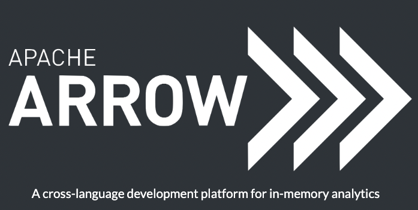
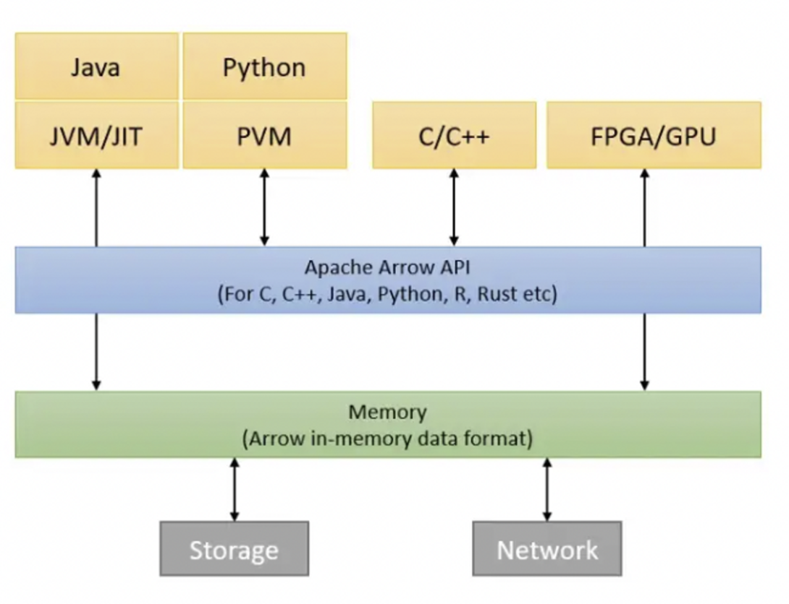
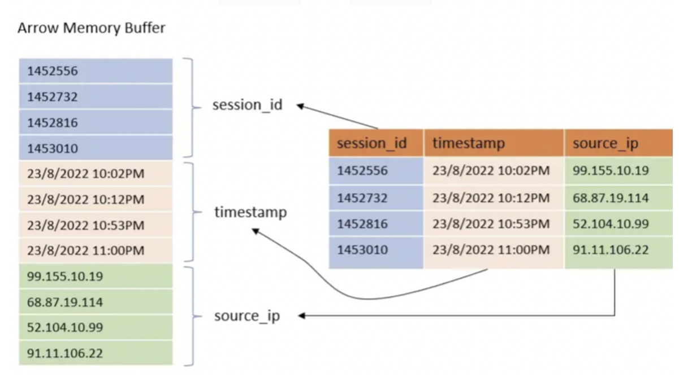
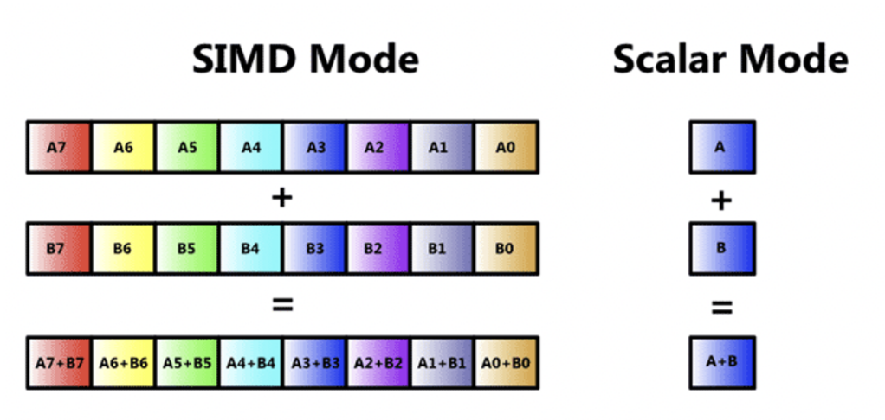
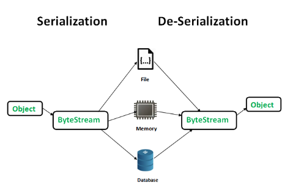

## 서문
&nbsp;&nbsp;2023년을 맞아 기분전환도 하고 새로운 경험을 해보고 싶어, 이전 직장 동료(A씨)와 스터디를 시작했습니다. 마침 A씨도 새로운 것에 대한 갈증이 있었는지 금방 의기투합하여 날짜를 정하고 나름 빠르게 진행하게 되었는데요. 주제를 무엇을 할지 고민하다가 서로 Data Engineering 백그라운드를 가지고 있다보니 자연스럽게 그쪽으로 시선이 쏠렸습니다만.. 평소에 안하던걸 해보고 싶다는 생각끝에 Apache Arrow를 첫 주제로 선정하게 되었습니다.

&nbsp;&nbsp;사실 저는 이름만 간간히 들어보고 정확히 무엇을 하는건지 모르고 있었는데 spark, pandas 등 많은 라이브러리에서 사용하는 것을 보니 이쪽의 core라는 생각이 들었고 한번 보면 재밌겠다는 생각으로 시작을 하게 되었습니다. 
  
## 스터디 계획
&nbsp;&nbsp;가볍게 시작했지만 최대한 의미있는 스터디를 진행하기 위해 아래와 같은 규칙을 정하고 시작하였습니다.
  - 하나의 주제에 대해 최대 6주 진행
  - 주제가 끝날 떄 format은 상관없이 output을 만들기 (Blog, 발표, etc.)
  - 인원이 2명이므로 벌칙 rule은 따로 없지만 최대한 책임감 있게 스터디 진행
  - 이전 회차에 다음 회차 주제를 대략적으로 선정하고 각자 내용 파악해온 것을 공유. (서로 보는 관점이 다르기 떄문에 겹쳐도 상관없는 것으로 간주)

## Apache Arrow란 도대체 무엇을 하는 녀석일까?

&nbsp;&nbsp;공식 사이트에서 Apache Arrow 정의를 보면 다음과 같습니다. `A cross-language development platform for in-memory analytics` 처음 이걸 보고 든 생각은 "아, 언어별로 제약 없이 in-memory 분석을 할 수 있게 도와주는 개발 플랫폼인가?" 라는 아주 직관적인 생각을 했습니다. 

&nbsp;&nbsp;사실 처음에는 어떻게 언어간 제약없이 그게 가능할지부터 시작해서 많은 의문점들이 떠올랐지만 추후에 공부를 하고 보니 결국 저 소개 문장이 Apache Arrow를 정의하는데 적절한 문장이라는 것을 깨달을 수 있었습니다. 결국 Arrow의 가장 중요한 핵심은 서로 다른 인프라에서 데이터를 공유할때 직렬화, 역직렬화로 발생하는 `오버헤드를 줄이고자 하는 것`에 있었고, 이를 `언어나 플랫폼 상관없이` 메모리상에서 컬럼 구조(columnar)로 데이터를 정의하여 빠르게 읽고 쓸수 있도록 하는것에 있었습니다. 

&nbsp;&nbsp;굳이 Arrow를 다시 정의해보자면, `테이블형 데이터셋을 표현하기 위해 표준화된 언어-비종속적인 인메모리 컬럼형식 명세` 라고 할 수 있을 것 같습니다. 위의 그림을 보면, 여러 언어 혹은 플랫폼에서 Arrow API를 이용하여 메모리에서 데이터를 접근하는 그림을 볼 수 있습니다. 

### Columnar Data Format이란? 

&nbsp;&nbsp; 잠깐 위에서 스쳐 지나가듯이 나온 Columnar Data Format에 대해 짚고 넘어가겠습니다. 일반적으로 위 그림에서 우측과 같이 Row 기반으로 데이터를 저장하는 형태가 많이 익숙하실 텐데요. 이를 좌측 그림처럼 컬럼별로 저장하는 방식을 Columnar Data Format이라고 지칭합니다. 이러한 포맷에는 ORC, Parquet등이 존재합니다. 

&nbsp;&nbsp; 이러한 방식을 이용하는데는 데이터 분석에 있어서 Row 기반 저장방식에 비해 많은 이점을 가져갈 수 있기 때문입니다. 보통 분석을 하면 모든 컬럼에 대해 작업하기 보다는 특정 컬럼 위주로 작업하는 경향이 많고, 집계나 여러 처리가 같은 컬럼이 연속적으로 붙어있을 때 많은 연산 이점을 가져갈 수 있습니다. 또한, 압축에 있어서도 비슷한 데이터가 연속적으로 있는 것이 더 유리한 면도 있습니다. 이러한 이점들 덕분에 대량의 데이터 분석 환경에서는 대부분 데이터 저장 포맷을 Columnar로 사용하는 것이 `de-facto`라고 할 수 있습니다.

## Apache Arrow의 구체적인 특징은 뭘까?

&nbsp;&nbsp; 위의 설명으로 Arrow를 cross-platform에서 분석이 필요한 상황에 용이하겠구나라고 대략 이해할 수 있습니다. 그렇다면 좀 더 구체적으로 어떤 특징을 가지고 있을까요?  

### 1. Performance Benefits

&nbsp;&nbsp; Apache Arrow를 이용하면 아래와 같은 성능 이점을 가져갈 수 있다고 합니다.

- Parallesim
- Pipelining
- Focus on CPU Efficiency
- Zero Copy Data Sharing
- Remove Network Overhead

&nbsp;&nbsp; 이점을 보면 몇몇 익숙한 것과 그렇지 않은것이 눈에 띕니다. `Focus on CPU Efficiency`가 무엇을 의미하는 걸까요? 조금 찾아보니 CPU의 L2 Cache Locality를 이용하는 것과, SIMD Instruction에 대한 이야기가 나옵니다. Cahce Locality는 직관적으로 이해가 가는데, SIMD Instruction은 뭘까요? 

#### SIMD Instruction

&nbsp;&nbsp; Single Instruction Multiple Data의 약자로써, CPU 연산을 하는 방식 중 하나입니다. CPU Single Clock Cycle안에 여러개의 연산을 동시에 수행하는 기법입니다. Vector 연산이라고도 불린다고 하네요. 아래 그림을 보면 직관적으로 이해가 되실 겁니다. 여러 연산을 CPU에서 한번에 수행할 수 있으니 그만큼 빨라지는 개념이죠. 물론 이게 가능하기 위해서는 여러 제약조건들이 조금 있긴 하지만, 적용할 수 있다면 성능 향상을 기대할 수 있을 것 같습니다. 조금 더 자세한 내용은 [위키](https://en.wikipedia.org/wiki/Single_instruction,_multiple_data) 등 Dive deep하게 공유하는 사이트 등을 참고 부탁 드립니다. 

#### Zero Copy Data Sharing

&nbsp;&nbsp; 이름만 보면 데이터 공유시에 Copy를 하지 않아 성능이 향상된다는 개념으로 보입니다. 내용을 살펴보니, Columnar In-memory format으로 zero-copy serialization을 수행하는 feature를 지칭합니다. 기존 Python같은 언어에서 객체를 다른 플랫폼으로 보내기 위해서는 Pickle등을 통해 Serialization, De-serialization 단계가 필요했습니다. 이런 연산 자체가 굉장한 오버헤드이기 떄문에, apache arrow에서는 이 단계를 없애서 오버헤드를 제거하고자 하였고 이것이 zero-copy 개념입니다.

&nbsp;&nbsp; 구체적으로 보면, 직렬화가 없기 때문에 애초에 직렬화된 데이터 자체를 가지고 작업합니다. 이는 네트워크 전송시에도 직렬화가 필요없기 때문에 데이터 전송 측면에서도 아주 효율적입니다. 직렬화를 하지 않는다면 읽는 쪽에서 어떻게 읽을 수 있지? 라는 생각이 들 수 있는데, 이러한 부분을 apache arrow에서 처리해준다고 생각하시면 되겠습니다. (정확히는 arrow에서 사용하는 메모리 라이브러리에서 처리합니다. 이는 바로 이어서 말씀드리겠습니다)

#### Google FlatBuffers

&nbsp;&nbsp; Apache Arrow 보는데 자꾸 다른 개념들을 소개하고 있어서 당황하실수도 있겠습니다. 하지만 대게 오픈소스가 그렇듯, Apache Arrow 또한 그 자체로 혼자 만들어진것이 아니라, 다른 수많은 오픈소스를 사용하며 만들어졌기에 공부를 할수록 다른 라이브러리에 대해 알아갈 수 밖에 없을 것 같습니다.(살려주세요)

&nbsp;&nbsp; Google에서 개발한 FlatBuffers 공식 사이트 첫줄을 보면 다음과 같이 소개되어 있습니다. `FlatBuffers is an efficient cross platform serialization library for C++, C#, C, Go, Java, Kotlin, JavaScript, Lobster, Lua, TypeScript, PHP, Python, Rust and Swift.` 즉, 직렬화 라이브러리인데 여러 언어에서 사용할 수 있는 효율적인 크로스 플랫폼 라이브러리입니다. Google의 Protobuf와 유사하지만, Object 접근 전에 역직렬화를 안해도 되어 protobuf 보다 성능이 뛰어나다고 합니다. (하지만 반대급부로 코드 생성량이 더 많습니다)

## Apache Arrow 1편 정리
&nbsp;&nbsp; 지금까지 성능 관련해서 간략하게 알아보았습니다. 다음 포스트에서는 Apache Arrow 내부 구현을 보면서 코드를 한번 살펴보고 위에서 말한 내용들이 어떻게 구현되어 있는지 한번 살펴보겠습니다. 

