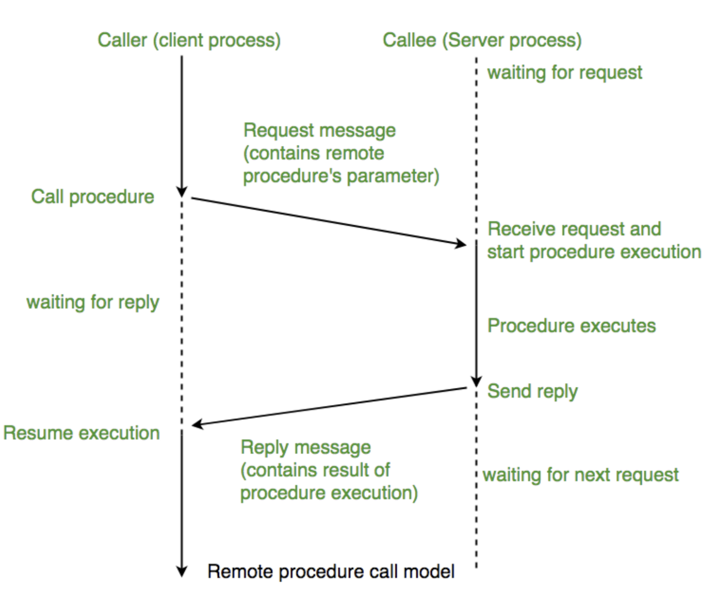

## 서문
&nbsp;&nbsp; 이전 포스트에서 Apache Arrow에 대해 간략한 내용과 특징들을 살펴보았습니다. 이번에는 이어서 성능이점 중 네트워크 관련하여 어떤 이점을 가지고 있는지 좀 더 살펴보겠습니다.

## Arrow Flight RPC

&nbsp;&nbsp; Apache Arrow에서 가져가는 성능상의 이점 중 `Remove Network Overhead` 항목이 있습니다. 이 부분을 알아보기 위해 Arrow Flight RPC가 무엇인지 알아 보았습니다. Arrow Flight RPC는 분산시스템에서 데이터를 서버간 전송하는 것에 사용하도록 디자인 된 고성능 RPC(Remote Procedure Call) Framework 입니다. gRPC와 IPC Format을 기반으로 구축이 되었다고 하는데, 본격적으로 알아보기 전에 RPC는 무엇인지 짚고 넘어가 보겠습니다. 

### RPC

&nbsp;&nbsp; RPC는 한국어로 원격 프로시저 호출로써 별도의 원격제어를 위한 코딩 작업 없이 다른 주소공간에서 함수나 프로시저를 실행할 수 있게 하는 프로세스간 통신 기술을 말합니다. 즉, 원격지의 프로세스에 접근하여 프로시저 또는 함수를 호출하는 건데요, IPC(Inter Process Communication)의 한 종류입니다. RPC를 이용하면 프로그래머는 함수가 있는 위치에 상관 없이 동일하게 함수를 호출 가능합니다. 

&nbsp;&nbsp; RPC의 목적은 크게 2가지입니다.

1. Encapsulation - Client-Server 간 커뮤니케이션 상세 정보 감추기
2. Interface - Client, Server는 일반 메소드를 호출하는 것 처럼 행동

&nbsp;&nbsp; 위 그림을 잘 보면, Stub과 RPC Runtime이 Client, Server에 각각 존재하여 Pack/Unpack, Receive/Send 동작을 하는 것을 볼 수 있습니다. 이러한 매커니즘을 통해 RPC를 사용하면 원격지에 있어도 로컬에서 호출하는 것과 같은 효과를 볼 수가 있는것이죠. 이러한 RPC의 대표적인 구현체로는 ProtocolBuffer, Thrift 등이 있습니다.

&nbsp;&nbsp; RPC의 장점으로는 로컬에서 호출하면서도 원격지를 신경쓸 필요가 없다는게 있습니다. 하부 네트워크는 프로토콜 매커니즘에 맡길 수가 있는 것이죠. 이에 프로세스간 통신 또한 쉽게 구현이 가능합니다. 단점으로는, 네트워크를 이용하기 때문에 호출 실행과 반환이 보장되지 않는다는점과 보안적인 측면에서 신경을 많이 써야 할 부분이 있다는 점 입니다.

### gRPC

&nbsp;&nbsp; gRPC는 구글에서 개발했고, 어느 환경에서나 실행할 수 있는 고성능 RPC 프레임워크입니다. 아래 아키텍처를 보면 위에서 설명한 RPC와 유사하다는 것을 알 수 있습니다. 

&nbsp;&nbsp; 여기 보면 stub이 계속 등장하는데요, stub이란 RPC의 핵심 개념으로 Parameter 객체를 Message로 Marshalling, Unmarshalling 하는 레이어입니다. 

> Marshalling, Unmarshalling vs Serialization, Deserialization?
- Serialization: 객체의 주소값이 참조하는 값을 저장하고, Primitive한 데이터로 변환하여 byte stream으로 저장 후 다른곳에서 다시 풀 수 있도록 하는 것을 말합니다.
- Marshalling: 변환하는 일련의 과정 자체를 뜻합니다. 즉 Marshalling Serialization 포함합니다.

&nbsp;&nbsp; gRPC는 IDL(Interface Definition Language)로 protocol buffer를 사용합니다. protocol buffer란 JSON, XML과 비슷한 데이터 직렬화 구조 중 하나입니다. gRPC의 특징으로는 높은 생산성과 다양한 언어 플랫폼을 지원하여 확장성이 좋고, HTTP/2 기반 양방향 스트리밍을 지원하며 각종 부분에서 최적화를 진행하여 성능이 뛰어나다는 장점이 있습니다.

