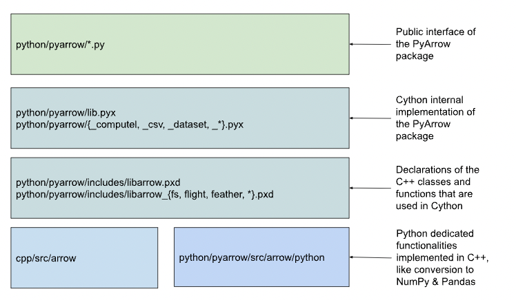

## 서문
&nbsp;&nbsp; 이전 포스트에서 Apache Arrow에 대해 간략한 내용과 특징들을 살펴보았습니다. 이번에는 내부 구현을 보면서 조금 더 살펴보려고 합니다. 여러 언어 구현체가 있지만, 가장 익숙한 Python으로 보겠습니다.

## PyArrow Architecture



&nbsp;&nbsp; Python에서는 Apache Arrow를 PyArrow라는 이름으로 구현하였습니다. PyArrow는 Arrow C++ Implementation에서 제공하는 대부분의 기능을 `Cython`으로 wrapping 하여 제공한다고 보면 됩니다. 

## Quick Start

```python
...
mmap_file = pa.memory_map('demo-file.arrow', r)
table = pa.ipc.RecordBatchFileReader(mmap_file).read_all()
df = table.to_pandas()
# pandas -> arrow -> pandas
table_pa = pa.Table.from_pandas(df_pandas)
df_pandas = table_pa.to_pandas()
...
```

&nbsp;&nbsp; 위 코드는 Apache Arrow Quick Start code 입니다. 
