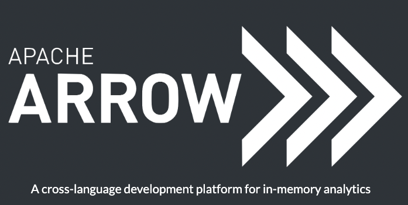
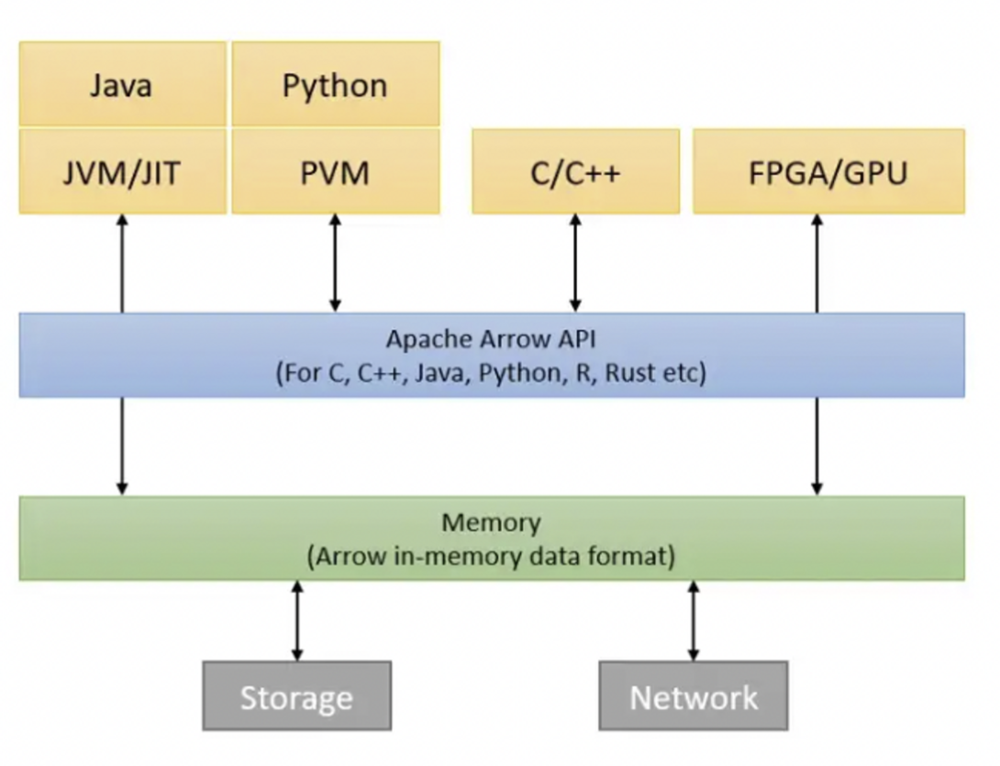
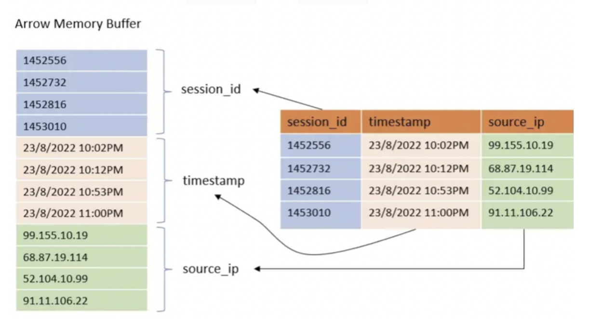

## 서문
&nbsp;&nbsp;2023년을 맞아 기분전환도 하고 새로운 경험을 해보고 싶어, 이전 직장 동료(A씨)와 스터디를 시작했습니다. 마침 A씨도 새로운 것에 대한 갈증이 있었는지 금방 의기투합하여 날짜를 정하고 나름 빠르게 진행하게 되었는데요. 주제를 무엇을 할지 고민하다가 서로 Data Engineering 백그라운드를 가지고 있다보니 자연스럽게 그쪽으로 시선이 쏠렸습니다만.. 평소에 안하던걸 해보고 싶다는 생각끝에 Apache Arrow를 첫 주제로 선정하게 되었습니다.

&nbsp;&nbsp;사실 저는 이름만 간간히 들어보고 정확히 무엇을 하는건지 모르고 있었는데 spark, pandas 등 많은 라이브러리에서 사용하는 것을 보니 이쪽의 core라는 생각이 들었고 한번 보면 재밌겠다는 생각으로 시작을 하게 되었습니다. 
  
## 스터디 계획
&nbsp;&nbsp;가볍게 시작했지만 최대한 의미있는 스터디를 진행하기 위해 아래와 같은 규칙을 정하고 시작하였습니다.
  - 하나의 주제에 대해 최대 6주 진행
  - 주제가 끝날 떄 format은 상관없이 output을 만들기 (Blog, 발표, etc.)
  - 인원이 2명이므로 벌칙 rule은 따로 없지만 최대한 책임감 있게 스터디 진행
  - 이전 회차에 다음 회차 주제를 대략적으로 선정하고 각자 내용 파악해온 것을 공유. (서로 보는 관점이 다르기 떄문에 겹쳐도 상관없는 것으로 간주)

## Apache Arrow란 도대체 무엇을 하는 녀석일까?

&nbsp;&nbsp;공식 사이트에서 Apache Arrow 정의를 보면 다음과 같습니다. `A cross-language development platform for in-memory analytics` 처음 이걸 보고 든 생각은 "아, 언어별로 제약 없이 in-memory 분석을 할 수 있게 도와주는 개발 플랫폼인가?" 라는 아주 직관적인 생각을 했습니다. 

&nbsp;&nbsp;사실 처음에는 어떻게 언어간 제약없이 그게 가능할지부터 시작해서 많은 의문점들이 떠올랐지만 추후에 공부를 하고 보니 결국 저 소개 문장이 Apache Arrow를 정의하는데 적절한 문장이라는 것을 깨달을 수 있었습니다. 결국 Arrow의 가장 중요한 핵심은 서로 다른 인프라에서 데이터를 공유할때 직렬화, 역직렬화로 발생하는 `오버헤드를 줄이고자 하는 것`에 있었고, 이를 `언어나 플랫폼 상관없이` 메모리상에서 컬럼 구조로 데이터를 정의하여 빠르게 읽고 쓸수 있도록 하는것에 있었습니다. 

&nbsp;&nbsp;굳이 Arrow를 다시 정의해보자면, `테이블형 데이터셋을 표현하기 위해 표준화된 언어-비종속적인 인메모리 컬럼형식 명세` 라고 할 수 있을 것 같습니다. 위의 그림을 보면, 여러 언어 혹은 플랫폼에서 Arrow API를 이용하여 메모리에서 데이터를 접근하는 그림을 볼 수 있습니다. 

### Columnar Data Format이란? 

&nbsp;&nbsp; 잠깐 Columnar Data Format에 대해 짚고 넘어가겠습니다. 일반적으로 위 그림에서 우측과 같이 Row 기반으로 데이터를 저장하는 형태가 많이 익숙하실 텐데요. 이를 좌측 그림처럼 컬럼별로 저장하는 방식을 Columnar Data Format이라고 지칭합니다. 이러한 포맷에는 ORC, Parquet등이 존재합니다. 

&nbsp;&nbsp; 이러한 방식을 이용하는데는 데이터 분석에 있어서 Row 기반 저장방식에 비해 많은 이점을 가져갈 수 있기 때문입니다. 보통 분석을 하면 모든 컬럼에 대해 작업하기 보다는 특정 컬럼 위주로 작업하는 경향이 많고, 집계나 여러 처리가 같은 컬럼이 연속적으로 붙어있을 때 많은 연산 이점을 가져갈 수 있습니다. 또한, 압축에 있어서도 비슷한 데이터가 연속적으로 있는 것이 더 유리한 면도 있습니다. 이러한 이점들 덕분에 대량의 데이터 분석 환경에서는 대부분 데이터 저장 포맷을 Columnar로 사용하는 것이 `de-facto`라고 할 수 있습니다.

