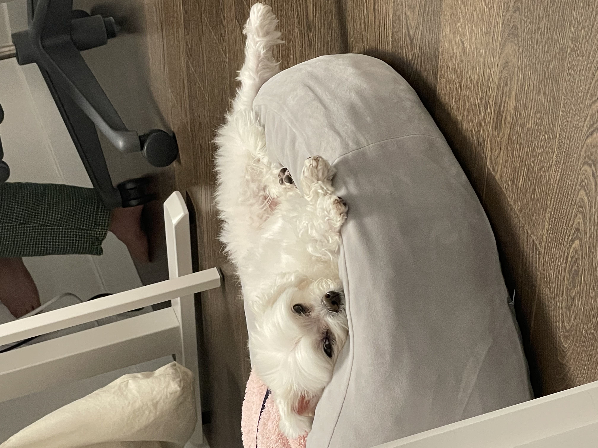

## 2023-01-29 일요일

  전날 [AWS 자격증](https://www.credly.com/badges/3c560133-1c3b-4dbc-96b8-4edc5f7f713f/public_url) 시험을 저녁 9시부터 11시반까지 쳐서 그런지 아침에 일어나기가 너무 힘들었습니다. 배고프다고 하는 와이프와 실시간으로 꼬르륵 소리를 내는 강아지 소리를 들으며 간신히 일어나서 아침부터 김밥을 사왔죠. 그리고 전날 미처 못간 운동을 가면서 아침을 개운하게 시작했네요.

## 강남, 친구
  오늘은 오랫만에 주말에 친구들을 보는 날 입니다. 친한 대학교 친구들과 오랜만에 만났죠. 와이프 추천으로 강남역 [진해장](https://naver.me/xiv5mYor) 
  이라는 곳에 갔는데, 조금 비싸긴 했지만 엄청 맛있었습니다. 오랜만에 만나 이런저런 이야기를 하다가, 꽤 재미있는 주제로 이야기를 했었죠.

### ChatGPT, 이루다, AI
  노기마기라는 별명을 가진 친구가 있는데, 갑자기 [이루다](https://luda.ai/)와 [ChatGPT](https://openai.com/blog/chatgpt/) 이야기를 하며 재밌는 이야기를 시작합니다. 2023년 현재, 사람과 대화가 꽤 의미있는 수준으로 가능할 만큼 AI들의 수준이 많이 올라왔고 이를 곰곰히 생각해본 친구가 가상 BJ를 만들어서 24시간 돌려보겠다는 생각을 한거죠. 이쪽 분야를 평소에 잘 모르는 사람에게는 이게 무슨 이상한 소리인가 싶겠지만, 저는 평소에도 ChatGPT를 업무에 잘 활용하고 있었기 때문에 꽤 재미있게 들렸습니다. 능력있는 친구라 이친구가 삘받으면 뭐라도 하겠구나 생각도 들었구요.

### 어렵지만 가치가 많은 일 vs 쉽지만 가치가 적은 일
  이 주제는 대부분의 사람들이 인생에 있어서 한번쯤 생각해볼 만한 주제인 것 같습니다. 이 역시 노기마기라는 친구가 최근에 하고 있는 고민인데 부서 이동을 고민하면서 나온 이야기입니다. A 부서는 핵심부서로, 일이 상상 이상으로 어렵고 시간을 많이 투자해야 하지만 젊을 때 고생을 그만큼 하면 나중에 혹시 좀 더 좋은 기회가 올 수도 있는 반면에 B 부서는 지원부서로, 일이 쉽고 워라밸이 좋은 반면에 시간이 지났을 때 자신의 가치가 떨어질 수도 있는 곳인데 이러한 상황 속에서 두 부서에 대한 고민이었습니다. 결론은 - B부서에 있으면서 자신의 가치를 올릴 수 있는 다른 방법을 찾아라! 는 느낌으로 되었지만, 저는 작년에 했던 이직이 A부서와 같은 느낌이었기 때문에(구체적으로 들어가면 약간 다르긴 하지만) 사실 이 선택은 확실히 개개인의 특성에 따라 다른 것 같다고 느꼈습니다.

### 부동산
  2023년 현재, 전 세계적으로 경제 상황이 좋지 않고 대한민국 역시 비슷하게 흘러가고 있습니다. 부동산 역시 비슷한데, 작년만 하더라도 끝도 모르고 치솟던 집값이 벌써 어마어마하게 떨어지면서 미달난 무순위 청약을 지원 하는지 마는지에 대한 이야기를 했습니다. 이는 부동산을 투자의 개념으로 보는지, 실거주의 개념으로 보는지에 따라 선택의 여지가 달라지게 되는데 이야기를 꺼낸 친구는 실거주를 생각하고 있고 평소에 투자에 감각이 많이 있던 친구도 아니라 부동산에 돈 묶이는 것에 개의치 않는다면 지금도 나쁘지 않다고 이야기를 했네요. 미래는 모르는 거니까 이런 이야기는 아주 조심스럽습니다.. :)

## 집
  친구들과 만나고 집에 왔더니 와이프와 복이가 기다리고 있네요. 가정을 꾸린지 1년 조금 넘었지만, 이런게 행복인가 싶습니다 :) 우리 복이 사진 보고 가세요! ㅎㅎ (사진이 약간 찌그러지는데, 클릭하면 잘 나오네요)

  

