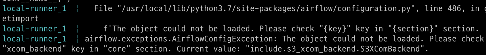
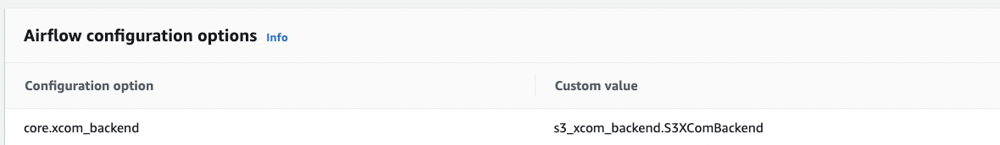
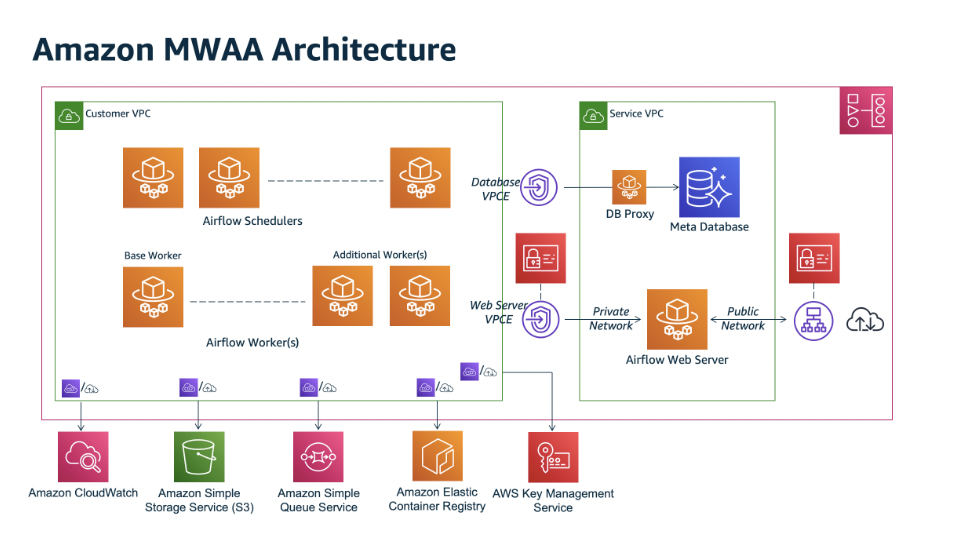
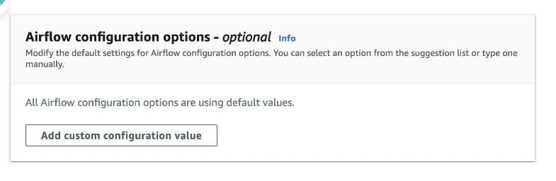
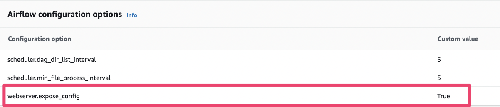
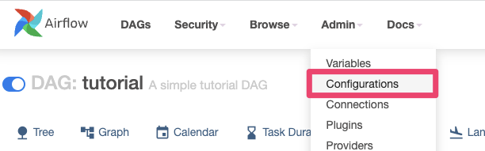
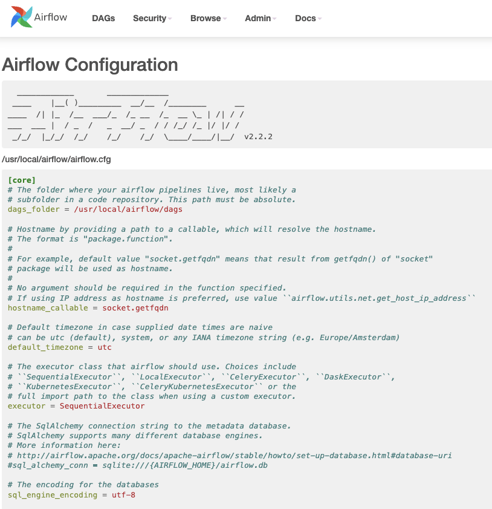

  
---
title: ""
description: "2022년 프로그래머스에서 주최한 실리콘밸리에서 날아온 데이터 엔지니어링 강의 컨퍼런스 후기"
date: 2022-11-10
update: 2022-11-10
tags:
- Data Engineering
- Programmers
---

## 문제

- AWS MWAA `airflow.cfg`에 custom xcom backend를 등록하기 위해 `core.xcom_backend:include.s3_xcom_backend.S3XComBackend` 적용 시
  클러스터 업데이트 실패

## 해결

### 1. airflow.cfg 옵션 변경 실패에 대한 디버깅

1. 이슈 재현
    - local에 mwaa 환경 구축 후 `core.xcom_backend:include.s3_xcom_backend.S3XComBackend` 적용시 클러스터 상태 확인

      

    - `AirflowConfigException: The object could not be loaded` 확인
    - MWAA에서는 Config 실패로 인한 retry 등으로 API Timeout이 날 때 까지 오랜 시간 Cluster 상태가 `Updating`일 수 있습니다.

2. 기본 값 적용시 내용 확인
    - `"core.xcom_backend": "airflow.models.xcom.BaseXCom"`

      → 성공

      → Value값에 참조할 수 없는 값이 들어가면 실패하는 것을 유추할 수 있습니다

3. `dags/` 폴더에 `s3_xcom_backend.py` 파일 생성 후 configuration 적용
    - `"core.xcom_backend": "s3_xcom_backend.S3XComBackend"`

   

   → **성공**

### 2. MWAA Managed Node 접근 방법이 있을까?

- Managed service이고 내부적으로 `Amazon ECS on Fargate`로 동작하기 때문에 airflow가 설치된 host의 shell로 접근할 수 있는 방법은 현재 존재하지 않습니다.
- MWAA Architecture

  

### 3. Airflow Configuration 변경 방법

- 현재 MWAA에서는 airflow.cfg를 **직접적**으로 변경할 수 있는 방법을 제공하지 않습니다.
- 가능한 방법은 아래 3가지 입니다.
    1. `CFN`이나 `CDK`등 `IaC`를 사용하여 생성하거나 업데이트 할 때 옵션 반영
        - `AirflowConfigurationOptions`
    2. WEB UI를 통한 방법

  

    3. AWS-CLI를 통한 방법

    ```bash
    #!/bin/bash
    # update configuration
    aws mwaa update-environment \
    --name xcom_backend_test \
    --airflow-configuration-options """{
      \"scheduler.dag_dir_list_interval\": \"5\",
      \"scheduler.min_file_process_interval\": \"5\",
      \"webserver.expose_config\": \"True\"
      }"""
      ```

    ```bash
    #!/bin/bash
    # check configuration
    aws mwaa get-environment \
    --name xcom_backend_test | \
    jq -r '.Environment.AirflowConfigurationOptions'
    ```

### 4. AWS-MWAA-LOCAL-RUNNER

- MWAA 환경에 직접적인 접근은 어렵지만, [aws-mwaa-local-runner](https://github.com/aws/aws-mwaa-local-runner)를 통해 local에 MWAA를
  mocking하여 테스트를 할 수 있습니다.

  ```bash
  1. /aws-mwaa-local-runner/docker/config/airflow.cfg 변경
  2. ./mwaa-local-env build-image
  3. ./mwaa-local-env start
  4. airflow.cfg 반영 확인
  ```

### 5. 현재 MWAA에 적용된 airflow.cfg 값 및 환경변수 확인 방법

- 여기에는 몇가지 방법이 있을 수 있습니다.

1. 환경변수에서 확인

  ```python
  from __future__ import annotations

  import logging
  import os
  from datetime import datetime, timedelta

  from airflow import DAG
  from airflow.operators.python import PythonOperator

  logger = logging.getLogger(__name__)

  with DAG(
  'get_env_var',
  default_args={
    'depends_on_past': False,
    'retries': 1,
    'retry_delay': timedelta(minutes=5)
    },
    description='check mwaa configuration',
    start_date=datetime(2022, 11, 26),
    catchup=False
    ) as dag:
    def print_env_vars():
    keys = dict(os.environ)
    for k, v in keys.items():
    print(f'{k}: {v}')

  get_env_vars_operator = PythonOperator(
  task_id='get_env_vars_task',
  python_callable=print_env_vars
  )
  ```

2. airflow.cfg 파일에서 확인

  ```python
  from __future__ import annotations

  import logging
  import os
  from datetime import datetime, timedelta

  from airflow import DAG
  from airflow.operators.python import PythonOperator

  logger = logging.getLogger(__name__)

  with DAG(
  'get_airflow_cfg_file',
  default_args={
    'depends_on_past': False,
    'retries': 1,
    'retry_delay': timedelta(minutes=5)
    },
    description='check mwaa configuration',
    start_date=datetime(2022, 11, 26),
    catchup=False
    ) as dag:
    def print_airflow_cfg():
    with open(f"{os.getenv('AIRFLOW_HOME')}/airflow.cfg", 'r') as airflow_cfg:
    file_contents = airflow_cfg.read()
    print(f'\n{file_contents}')

  get_airflow_cfg_operator = PythonOperator(
  task_id='get_airflow_cfg_task',
  python_callable=print_airflow_cfg
  )
  ```

3. airflow.configuration.conf 확인

  ```python
  from __future__ import annotations

  import logging
  from datetime import datetime, timedelta

  from airflow import DAG
  from airflow.configuration import conf
  from airflow.operators.python import PythonOperator

  logger = logging.getLogger(__name__)

  with DAG(
  'get_airflow_cfg',
  default_args={
    'depends_on_past': False,
    'retries': 1,
    'retry_delay': timedelta(minutes=5)
    },
    description='check mwaa configuration',
    start_date=datetime(2022, 11, 26),
    catchup=False
    ) as dag:
    def get_conf_vars():
    logging.info(
    f"AIRFLOW__CORE__XCOM_BACKEND: {conf.get(section='CORE', key='XCOM_BACKEND')}"
    )

  get_conf_vars_operator = PythonOperator(
  task_id='get_conf_vars_task',
  python_callable=get_conf_vars
  )
  ```

4. MWAA Web UI에서 확인

- 진행 과정 요약
- "webserver.expose_config": "True” 값을 먼저 설정합니다.



- MWAA Web UI → Admin → Configuration에 들어갑니다.



- UI에서 airflow.cfg를 확인합니다



## Summary

- MWAA의 세팅 관련 참고할만한 자료입니다.
    - [https://catalog.workshops.aws/amazon-mwaa-for-analytics/en-US](https://catalog.workshops.aws/amazon-mwaa-for-analytics/en-US)
    - [https://catalog.workshops.aws/aws-data-ingestion-pipeline/ko-KR](https://catalog.workshops.aws/aws-data-ingestion-pipeline/ko-KR)
- xcom_backend의 값으로 **참조 가능한 경로에 파일이 있어야만** 클러스터 정상 업데이트 가능합니다.
- airflow.cfg 값을 호스트에 접근하여 직접적으로 변경할 수 있는 방법은 없습니다.
- MWAA는 Managed service이기 때문에, 위에 설명드린 방법으로 우회하여 구조 등을 확인하실 수 있습니다.
- 현재 MWAA에서는 만약 `잘못된 세팅값`으로 클러스터를 업데이트 시키면, 내부 요인에 의해 장시간 클러스터pending 상태가 될 수 있습니다. 이를 대비하는 방법은 아래와 같습니다.
    - aws-mwaa-local-runner로 미리 구성을 확인합니다.
    - Network or Permission 문제일 수도 있기 때문에 [링크와](https://github.com/awslabs/aws-support-tools/tree/master/MWAA) 같은 도구를
      이용하는 것을 추천 드립니다.
    - MWAA `23년 마일스톤`으로 클러스터 업데이트 구성 지연 이슈는 해결될 예정입니다.

## References

- [https://programmaticponderings.com/2020/12/29/amazon-managed-workflows-for-apache-airflow-configuration-understanding-amazon-mwaas-configuration-options/](https://programmaticponderings.com/2020/12/29/amazon-managed-workflows-for-apache-airflow-configuration-understanding-amazon-mwaas-configuration-options/)
- [https://airflow.apache.org/docs/apache-airflow/2.2.2/configurations-ref.html](https://airflow.apache.org/docs/apache-airflow/2.2.2/configurations-ref.html)
- [https://docs.aws.amazon.com/mwaa/latest/userguide/configuring-env-variables.html#configuring-env-variables-airflow-ref](https://docs.aws.amazon.com/mwaa/latest/userguide/configuring-env-variables.html#configuring-env-variables-airflow-ref)
- [https://docs.astronomer.io/learn/custom-xcom-backends](https://docs.astronomer.io/learn/custom-xcom-backends)
- [https://docs.aws.amazon.com/mwaa/latest/userguide/what-is-mwaa.html](https://docs.aws.amazon.com/mwaa/latest/userguide/what-is-mwaa.html)