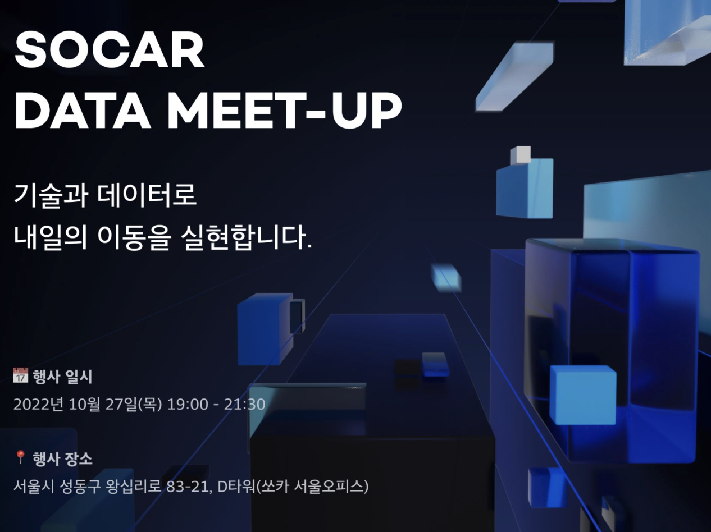
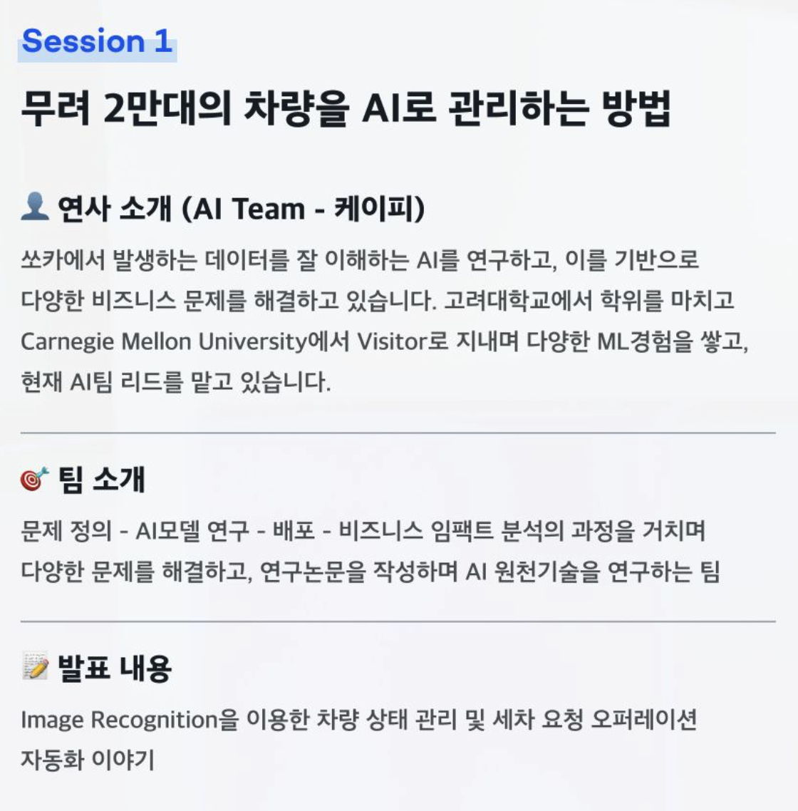
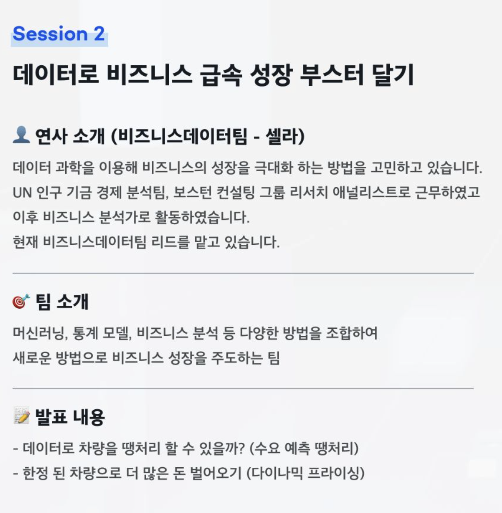
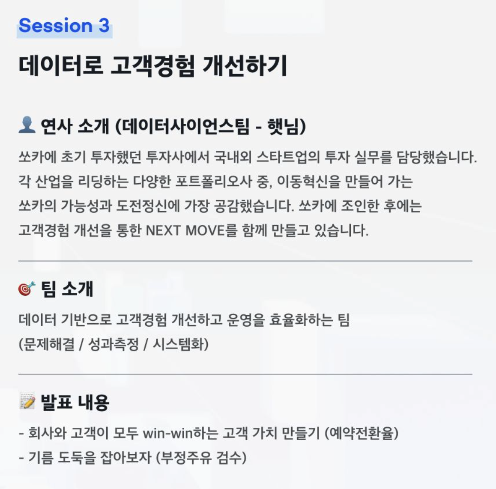
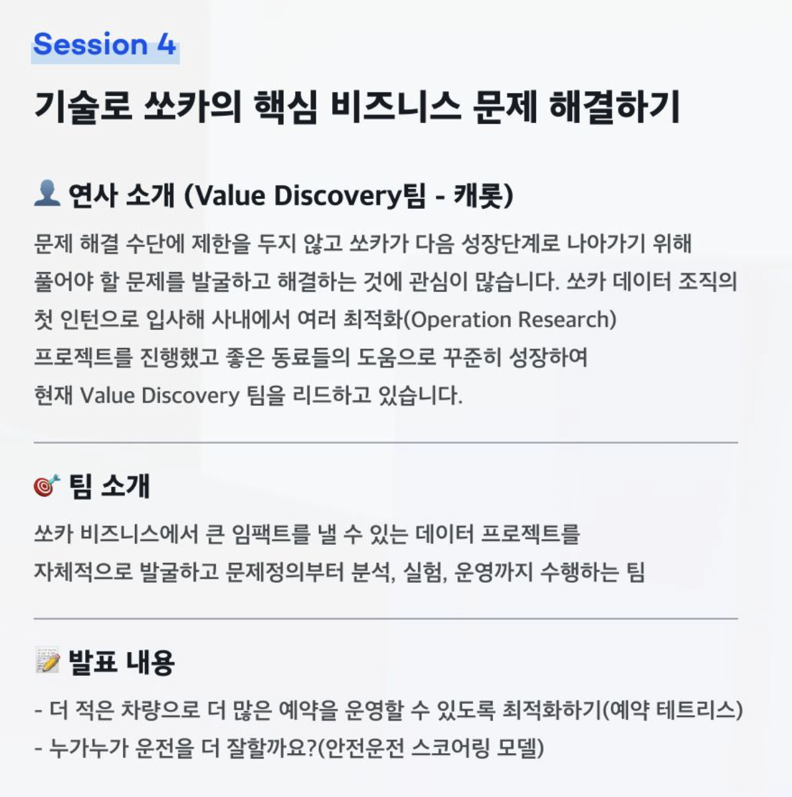

# 2022 Socar Data Meet-Up

어느날, 링크드인 피드를 둘러보던 중 관심이 가는 [글](https://www.linkedin.com/feed/update/urn:li:activity:6986550988979539968/?updateEntityUrn=urn%3Ali%3Afs_feedUpdate%3A%28V2%2Curn%3Ali%3Aactivity%3A6986550988979539968%29)을 보았습니다. 바로 2022 쏘카 데이터 밋업인데요, 이전에 [데이터 엔지니어링 컨퍼런스](https://dev-owner.github.io/blog/review-programmers-data-engineering-conference)를 다녀온 후로 이런 오프라인 밋업에 대한 이미지가 좋아져서 바로 등록 신청 했습니다.

발표 주제는 아래와 같았습니다.

1. 무려 2만대의 차량을 AI로 관리하는 방법
2. 데이터로 비즈니스 급속 성장 부스터 달기
3. 데이터로 고객경험 개선하기
4. 기술로 쏘카의 핵심 비즈니스 문제 해결하기

조금 일찍 도착하여 먼저 도착하신분들과 쏘카에서 제공해준 간단한 저녁거리를 먹으며 담소를 나누었는데, 이번 밋업 경쟁률이 8:1이라는 소리를 듣고 꽤 놀랐습니다 :) 한편으로는 제가 너무도 운이 좋게 뽑혔구나 생각도 들었구요.

사실, 신청 당시에 바빠서 주제를 대충 보고 넘어갔다가 당일에 도착해서 대부분 `Data Science`쪽 관련 내용이라는것을 깨달았습니다. (필자는 Data Engineering쪽에 관심이 더 많았습니다..) 어쨌든 데이터쪽 분야 주제는 모두 흥미롭기 때문에 크게 실망하지 않고 세션 4개를 모두 잘 들었습니다.

세션들은 모두 재밌게 들었는데 포스팅 목적으로 간 것이 아니라 따로 기록을 하지 않아 세부적인 내용을 공유드릴 수가 없어서 아쉽습니다. 대략적인 느낌만 공유 드리자면 데이터 조직의 크기나 하고 있는 일들을 봤을 때, `이 회사 정말 데이터에 진심`이구나를 느꼈습니다. 비즈니스에서 풀어야 하는 문제들도 많은것 같고 그러한 문제들을 하나하나 데이터에 기반하여 잘 풀어나가는 것이 뭔가 이상적인 모습처럼 보였어요.

놀랐던것 중에 하나는 연사분들은 모두 팀장분들이셨는데 그 중 한분이 4년전 인턴으로 시작해서 지금 팀장역할을 하고 있는 모습이 정말 성과 위주로 사람을 평가한다고 느꼈습니다. 놀람 포인트가 하나 더 있는데, AI관련되어 Lab처럼 각종 유명 저널이나 컨퍼런스에 꾸준히 논문도 등록하고 있는것으로 보여서 그저 돈버는데만 집중하기보다 구성원들의 커리어와 업계에 기여를 하고있다는 느낌도 많이 받았습니다.

세션이 다 끝나고, 쏘카측에서 발표 팀원분들과 직접적으로 Q&A를 할 수 있는 방을 따로 잡아 시간을 마련해 주셨습니다. 개인적으로 다른분들과 네트워킹 시간이 따로 없어 아쉬운 부분이 있었지만 그래도 쏘카 구성원들과 만날 수 있어서 좋았습니다.

저는 죄송스럽게도 발표해주신 팀들보다 Data Engineering팀에 관심이 많았는데 마침 해당 팀도 방에서 Q&A를 진행해 주셔서 운좋게 참석할 수 있었습니다.

들어가보니 제가 평소에 흥미롭게 읽었던 [데이터에 신뢰성과 재사용성까지, Analytics Engineering with dbt](https://tech.socarcorp.kr/data/2022/07/25/analytics-engineering-with-dbt.html)글의 저자이신 험프리님이 해당 팀의 팀장 입장으로 계셔서 꽤나 놀랐습니다. 인사를 나누고, 제가 일하면서 궁금했던 점들을 몇가지 질문했는데 정말 시간이 금방 가더라구요. 다른분들 질문들도 재미있었고 정말 유익한 시간이었습니다.

이렇게 팀원분들과 미팅까지 끝나니 어느덧 10시가 넘어 집으로 가는데 같은 방에서 Q&A를 하시던 분과 지하철역까지 걸어가면서 더 이야기를 할 정도로 다른 참석하신분들도 열정이 대단하셨던것 같습니다.

평소 밖을 나가지 않는 성격이라 이런 오프라인 밋업을 선호하지 않았는데 2회차 밋업도 좋은 인상으로 남아 앞으로 점점 더 많이 기웃거릴것 같네요!